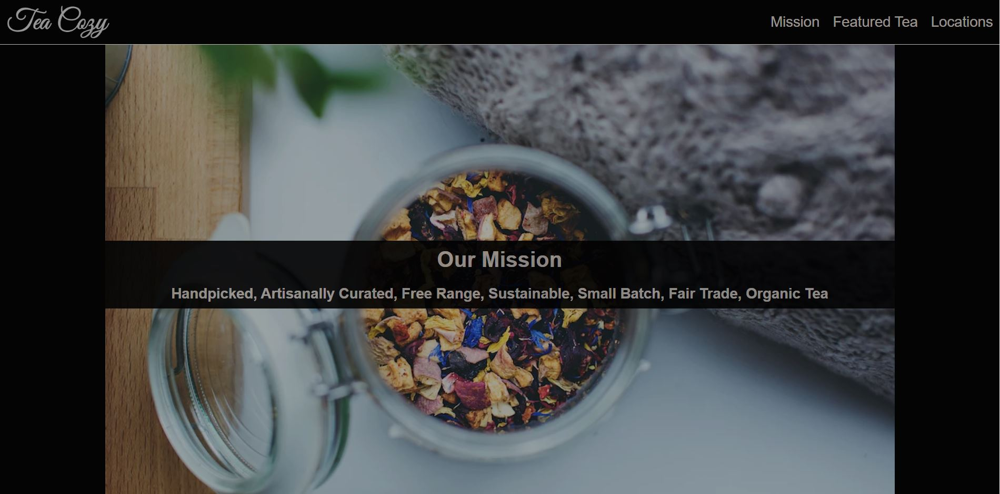

# Tea Cozy
Sample website for Tea Cozy, a fictional tea shop, for practice with responsive web design. Created as part of  the Full Stack Engineering Course at Codecademy. 

## Table of Contents
* [Technologies Used](#technologies-used)
* [Screenshots](#screenshots)
* [Features](#features)
* [Setup](#setup)

## Technologies Used
   
- HTML5
- CSS3
- Git
- GitHub

## Screenshots

## Features
- Responsive design

## Setup
- Available on [GitHub](https://github.com/RusselBrouts/TeaCozy)
